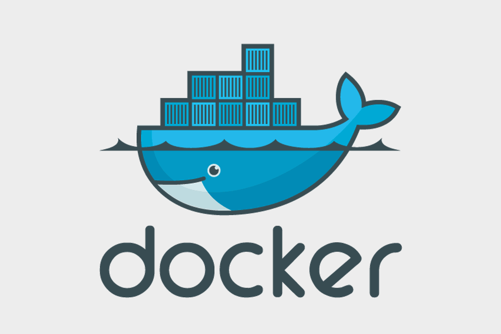

# Docker Helper
> A Docker experiments repository for general purpose.

[![NPM Version][npm-image]][npm-url]
[![Build Status][travis-image]][travis-url]
[![Downloads Stats][npm-downloads]][npm-url]

From the basic Network creation until its administration through Linux firewalls bridge.



## Under the Hood

### Docker Networking

Starging a new Docker Image:

```
docker run -ti --net=host ubuntu:16.04 bash
```

Adding Bridge-utils through apt-get:

```
apt-get update && apt-get install bridge-utils
```

Creating a brand new Network:

```
docker network create my-new-network
```

Bridge Command:

```
brctl show
```


OS X & Linux:

## Usage example


Thisnis going to be updated very soon and it will bring lots of nice examples of Docker networking.

_For more examples and usage, please refer to the [Wiki][wiki]._

## Development setup

This is going to have all the dependencies and directions in order to follow the examples.

```sh
make install
npm test
```

## Release History

* 0.2.1
    * CHANGE: Update docs (module code remains unchanged)
* 0.2.0
    * CHANGE: Remove `setDefaultXYZ()`
    * ADD: Add `init()`
* 0.1.1
    * FIX: Crash when calling `baz()` (Thanks @GenerousContributorName!)
* 0.1.0
    * The first proper release
    * CHANGE: Rename `foo()` to `bar()`
* 0.0.1
    * Work in progress

## Meta

Thiago Lima

Distributed under the XYZ license. See ``LICENSE`` for more information.

[https://github.com/yourname/github-link](https://github.com/dbader/)

## Contributing

1. Fork it (<https://github.com/thiagoblima/docker-helper/fork>)
2. Create your feature branch (`git checkout -b feature/fooBar`)
3. Commit your changes (`git commit -am 'Add some fooBar'`)
4. Push to the branch (`git push origin feature/fooBar`)
5. Create a new Pull Request


[npm-image]: https://img.shields.io/npm/v/datadog-metrics.svg?style=flat-square
[npm-url]: https://npmjs.org/package/datadog-metrics
[npm-downloads]: https://img.shields.io/npm/dm/datadog-metrics.svg?style=flat-square
[travis-image]: https://img.shields.io/travis/dbader/node-datadog-metrics/master.svg?style=flat-square
[travis-url]: https://travis-ci.org/dbader/node-datadog-metrics
[wiki]: https://github.com/seunome/seuprojeto/wiki