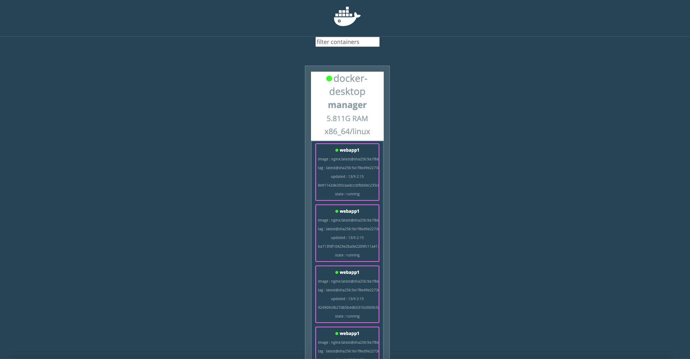
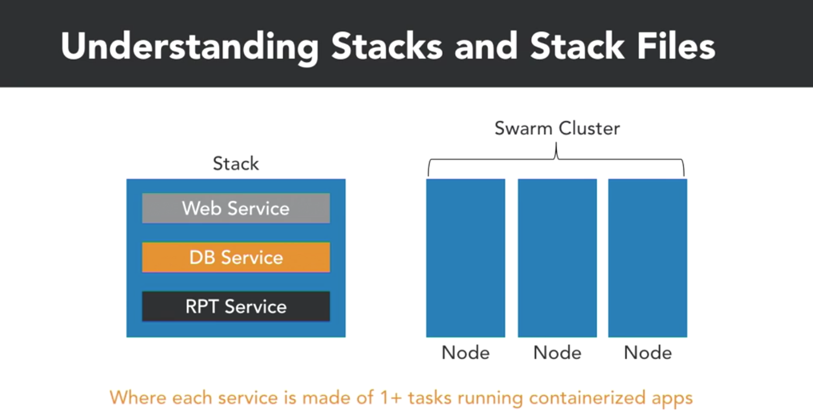
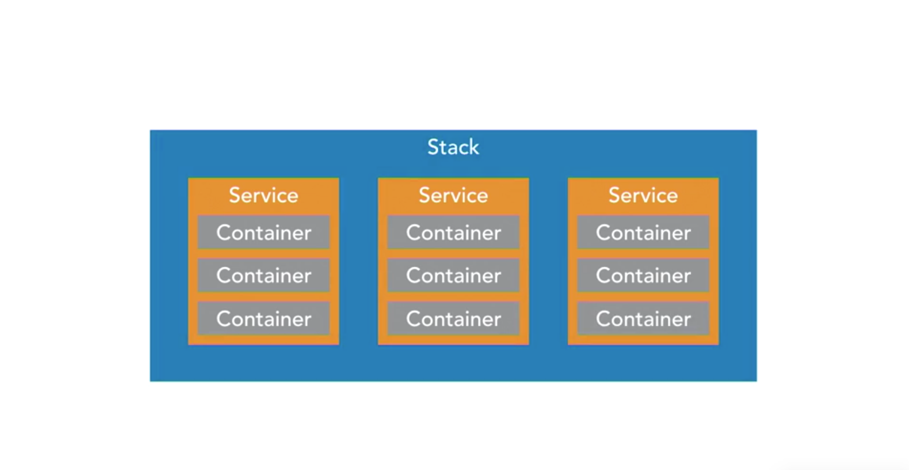

# DCA Preparation - Docker Certified Associate
> A Docker studying and experiments repository written for general purpose and knowledge spreading.

From the basic Network creation until its administration through Linux firewalls bridge.


## Play with Dokcer (PWD)

> https://labs.play-with-docker.com/

## Basic Docker installation environment in a Linux Kernel Distribution

#### Uninstall Docker 

```
sudo apt-get remove docker docker-engine docker-ce docker.io
```

#### Update the apt package index

```
sudo apt-get update
```

#### Allow apt to use a repository over HTTPS

```
sudo apt-get install \ 
apt-transport -https \
ca-certificates \
curl \
software-properties-common
```

#### Add Docker’s official GPG key to apt

```
curl -fsSL https://download.docker.com/linux/ubuntu/gpg | sudo apt-key add -
```

#### Verify that you now have the Docker GPG key

```
sudo apt-key fingerprint 0EBFCD88
```

#### Add the Docker repository to apt
```
sudo add-apt-repository \
   "deb [arch=amd64] https://download.docker.com/linux/ubuntu \
   $(lsb_release -cs) \
   stable"
```

#### Re-Update the apt package index now that we have the Docker repositories added

```
sudo apt-get update
```

#### Install a specific version of Docker

```
sudo apt-get install docker-ce=17.12.0~ce-0~ubuntu
```

#### Make sure that the Docker group is already added

```
sudo groupadd docker
```

#### Add your username to the Docker group

```
sudo usermod -aG docker $USER
```

## Docker 

## The Docker Flow: Images to Container

### Creating a container through the image:

Container creation:

```
docker run -ti ubuntu:latest bash
```

Exhibiting the container's info:

```
cat /etc/lsb-release

Result:

DISTRIB_ID=Ubuntu
DISTRIB_RELEASE=20.04
DISTRIB_CODENAME=focal
DISTRIB_DESCRIPTION="Ubuntu 20.04 LTS"

```

Having a lookt at the containers through the terminal:

```
docker ps --format "{{.ID}}: {{.Command}}"

Result:

ed33a850ca43: "bash"
d4ebdfb63526: "bash"
f63e60e1364d: "/bin/sh -c /app/sta…"
```

### Docker PS options

First simple and most commonly used:

```
docker ps

expected result:

CONTAINER ID        IMAGE                       COMMAND                  CREATED             STATUS              PORTS                    NAMES
d4ebdfb63526        ubuntu                      "bash"                   21 hours ago        Up 21 hours                                  magical_ellis
f63e60e1364d        prismagraphql/prisma:1.12   "/bin/sh -c /app/sta…"   5 weeks ago         Up 2 weeks          0.0.0.0:4466->4466/tcp   prisma-graphql_prisma_1
```

Showing the latest service started through Docker ps:

```
docker ps -l --format=$FORMAT

expected result:

ID	c967ca0da755
IMAGE	ubuntu:latest
COMMAND	"bash"
CREATED	5 minutes ago
STATUS	Exited (129) 5 minutes ago
PORTS	
NAMES	hardcore_banzai
```

### Docker Commit 

Creatinbg a new container:

```
docker run -ti --name=my-image  ubuntu:latest bash 
```

Checking out the created container in another terminal window:

```
docker ps -l --format=$FORMAT
```

Creating a new file:

```
mkdir development
cd development
touch server.js
```

Listing create file:

```
ls -lsa
```

Commiting the changes made:

```
docker commit ID

expected result:
sha256:49df31330335713db87a3a54f92b395df90399ef0f809bd05a62a3eab8d77c0c
```

## Under the Hood

### Docker Networking

Starging a new Docker Image:

```
docker run -ti --net=host ubuntu:16.04 bash
```

Adding Bridge-utils through apt-get:

```
apt-get update && apt-get install bridge-utils
```

Creating a brand new Network:

```
docker network create my-new-network
```

Bridge Command:

```
brctl show
```

### Docker Firewall | Linux iptables

Adding a new image:

```
docker run -ti --rm --net=host --privileged=true  ubuntu  bash
```

Updating Linux:

```
apt-get update
```

Installing iptables:

```
apt-get install i-tables
```

Running iptables: 

```
iptables -n -L -t nat
```

Running a new image | container:

```
docker run -ti --rm -p 8080:8080 ubuntu bash  
```

### Docker Processes and cgroups

Creating Container: 

```
docker run -ti --rm --name hello ubuntu bash 
```

Inspecting Docker Container ID:

```
docker inspect --format '{{.State.Pid}}' hello
```

Killing a container by its Pid:

```
docker run -ti --rm --net=host --privileged=true  --pid=host ubuntu  bash
kill pid
```

OS X & Linux:

## Usage example


This is going to be updated very soon and it will bring lots of nice examples of Docker networking.

_For more examples and usage, please refer to the [Wiki][wiki]._

## Development setup

First of all it's important to set the `$FORMAT` variable on your OS. To do so, follow the two steps:

* 1 - On your command line terminal: 

```
source /path/to/the/file/reformat.sh
```

* 2 - Test it by running on your command line terminal:

```
echo $FORMAT 

expected result:

ID	{{.ID}}
IMAGE	{{.Image}}
COMMAND	{{.Command}}
CREATED	{{.RunningFor}}
STATUS	{{.Status}}
PORTS	{{.Ports}}
NAMES	{{.Names}}

```

## Linux processes check

### Processes

Listing internel OS Linux processes:

```
ps -ef

expected result:

UID   PID  PPID   C STIME   TTY           TIME CMD
    0     1     0   0  3:24PM ??         0:11.62 /sbin/launchd
    0    90     1   0  3:24PM ??         0:00.60 /usr/sbin/syslogd
    0    91     1   0  3:24PM ??         0:01.15 /usr/libexec/UserEventAgent (System)
```

Listing all the IP (Internet Protocol):

```
ip addr
```
OR

```
/sbin/ifconfig 
```

## Docker Hub

Login into Docker Hub account:

```
docker login
```

Pulling an image from `Dokcer Hub`:

```
docker pull alpine
```

Check for the existing images:

```
docker images

expected result:

REPOSITORY             TAG                 IMAGE ID            CREATED             SIZE
alpine                 latest              a24bb4013296        1 minute ago        5.57MB
```

Adding a tag to a specific image (two parms *IMAGE ID* and *TAG NAME*):

```
docker tag a24 hub1/alpine:1
docker tag a24 hub1/alpine:2
docker tag a24 hub1/alpine:3
```

> Notice you only need to have the only first three digits of the Image ID

Testing tag created:

```
docker images

expected result:

REPOSITORY             TAG                 IMAGE ID            CREATED             SIZE
hub1/alpine            1                   a24bb4013296        2 months ago        5.57MB
hub1/alpine            2                   a24bb4013296        2 months ago        5.57MB
hub1/alpine            3                   a24bb4013296        2 months ago        5.57MB
```

Pushing to Docker Hub:

```
docker push hub1/alpine
```

If everything went well you should able to see:

> 50644c29ef5a: Pushed

Deleting the image locally:

```
docker image rm a24
```

In case you`ve got multiple tags for this image, you may need to force its deletion:

```
docker image rm a24 -f
```

Pulling the iage from Docker Hub again:

```
docker pull hub1/alpine:1
```

## Docker Linux management


> checking Dokcer Status

```
systemctl status docker
```

> stopping Docker service

```
sudo systemctl disable docker
```

> running Docker Deamon

```
sudo systemctl enable docker
```

## Backing Up Docker

* Docker Swarm cluster
* Universal Control Pane (UCP)
* Dokcer Trusted Registry (UTR)
* Container volume data

## Analyzing Dokcer erros

Adding Docker to the user group:

```
sudo usermod -aG docker $USER 
```

Checking the Docker version installed:

```
docker version

expected result:

Client: Docker Engine - Community
 Version:           19.03.12
 API version:       1.40
 Go version:        go1.13.10
 Git commit:        48a66213fe
 Built:             Mon Jun 22 15:41:33 2020
 OS/Arch:           darwin/amd64
 Experimental:      false
 
Server: Docker Engine - Community
 Engine:
  Version:          19.03.12
  API version:      1.40 (minimum version 1.12)
  Go version:       go1.13.10
  Git commit:       48a66213fe
  Built:            Mon Jun 22 15:49:27 2020
  OS/Arch:          linux/amd64
  Experimental:     false
 containerd:
  Version:          v1.2.13
  GitCommit:        7ad184331fa3e55e52b890ea95e65ba581ae3429
 runc:
  Version:          1.0.0-rc10
  GitCommit:        dc9208a3303feef5b3839f4323d9beb36df0a9dd
 docker-init:
  Version:          0.18.0
```

After checking the information aboce that is important to get the services started through the OS command:

```
sudo systemctl enable docker
```

Right after enabling Docker, then just get the Docker Deamon started:

```
sudo systemctl start docker
```

## Backing Up the Docker Swarm Cluster

```
systemctl stop docker
cd /var/lib/docker
cp -R swarm /tmp
systemctl start docker
```

## Docker Swarm Cluster

Initializing a new manager:

```
docker swarm init
```

The *Docker Swarm Join Token* is provided as follows: 

```
docker swarm join --token SWMTKN-1-5lufkc5kaepd6mfkkd6x9ej395g90xivr8exxo9jrza3qafy3s-b936x5ba3po60rr137s392o3r 12.31.6.4:2377
```

Checking the crated manager:

```
docker node ls

expected result:

ID                            HOSTNAME            STATUS              AVAILABILITY        MANAGER STATUS      ENGINE VERSION
vih0ywzgzyknt4ujzf1918dog *   DOCKER-MCH          Ready               Active              Leader              56.04.44
```

Adding a Adding another worker or leader:

```
docker swarm join-token manager
```

OR

```
docker swarm join-token worker
```

> basically it might be a leader or worker (depends on the other commands listed bellow)

#### Nodes, services, containers and tasks:

Taking a look at the official Dokcer Swarm documentation in order to understand better Docker Nodes through the link:

> https://docs.docker.com/engine/swarm/key-concepts/#nodes

Creating services and nodes example:

```
docker service create --name webapp1 --replicas=6 nginx

Result:

docker service create --name webapp1 --replicas=6 nginx
7ixe7benr2r6c85o8xyboof3x
overall progress: 6 out of 6 tasks 
1/6: running   [==================================================>] 
2/6: running   [==================================================>] 
3/6: running   [==================================================>] 
4/6: running   [==================================================>] 
5/6: running   [==================================================>] 
6/6: running   [==================================================>] 
verify: Service converged 
```

 For checking out the services you`ve created just run:

```
docker service ls  

Result:

ID                  NAME                MODE                REPLICAS            IMAGE               PORTS
7ixe7benr2r6        webapp1             replicated          6/6                 nginx:latest        
```

By running docker ps command you're able to see the replicas running in the cluster:

```
docker ps         

Result:

CONTAINER ID        IMAGE                       COMMAND                  CREATED             STATUS                 PORTS                    NAMES
93513eab195c        nginx:latest                "/docker-entrypoint.…"   36 minutes ago      Up 36 minutes          80/tcp                   webapp1.5.hwtuowagax01e2
fcd661f1056e        nginx:latest                "/docker-entrypoint.…"   36 minutes ago      Up 36 minutes          80/tcp                   webapp1.6.0uhf6s63gbn2nwo
48d9e0360eb3        nginx:latest                "/docker-entrypoint.…"   36 minutes ago      Up 36 minutes          80/tcp                   webapp1.1.kiac9py36u8fjmu
d2c5b4df0eb0        nginx:latest                "/docker-entrypoint.…"   36 minutes ago      Up 36 minutes          80/tcp                   webapp1.2.we1gzzx6oas5ft3
3d5f8d2fadf1        nginx:latest                "/docker-entrypoint.…"   36 minutes ago      Up 36 minutes          80/tcp                   webapp1.3.qtdx2lsi9kvf5of
9a60a229d170        nginx:latest                "/docker-entrypoint.…"   36 minutes ago      Up 36 minutes          80/tcp                   webapp1.4.3vpninag5qtmda3
```

#### Locking a swarm cluster

Check out the Docker Swarm Logking reference:

> https://docs.docker.com/engine/swarm/swarm_manager_locking/

In case you're creating a new swarm cluster it's good to go with the auto enabling lock by running:

```
docker swarm init --autolock
```

In case you need to enable autolock in a existing Docker Swarm Cluster, you should run the command:

```
docker swarm update --atulock=true

Result:

Swarm updated.
To unlock a swarm manager after it restarts, run the `docker swarm unlock`
command and provide the following key:

    SWMKEY-1-lIEE4UmB6oxuxnomsdfsdfsfezHzZS4keyK96QDkast2A0K3ytjg

Please remember to store this key in a password manager, since without it you
will not be able to restart the manager.
```

Now if you restart Docker it's going to ask you the token, because your nodes have been encrypted.

Restart Docker through the command (it may change according to your operational system):

```
sudo systemctl restart docker
```

After restarting it run:

```
docker node ls

Result:

Error response from daemon: Swarm is encrypted and needs to be unlocked before it can be used. Please use "docker swarm unlock" to unlock it.
```

Using the encrypted key to access the nodes on *Dokcer Swarm Cluster*:

```
docker swarm unlock                
Please enter unlock key: 

You should paste the token once generated as listed on commands above.
```

Generating another Docker Swarm Cluster unlock key:

```
docker swarm unlock-key
```

You can also rotate a security key for security reasons by running:

```
docker swarm unlock-key --rotate

Result: A new cluster key is going to be generated, replacing the old one once generated.
```

#### Why Quorum is important

Link to dive into the subject under discussion:

> https://docs.docker.com/engine/swarm/admin_guide/

To understand the consensus of the equation of which majority nodes you need in order to take the primary node here follows documentation:

> https://docs.docker.com/engine/swarm/raft/

## Managing Docker Swarm

Take a look at the official repository at:
> https://github.com/dockersamples/docker-swarm-visualizer

In order to visualize more information about Docker you might run:

```
docker info |more 
```

Initializing `Docker Swarm Visualizer`:

```
docker run -it -d -p 8080:8080 -v /var/run/docker.sock:/var/run/docker.sock dockersamples/visualizer

Result:
2d63f18b762abaaf945a7d8yrh564hd8b5f3ade4cfb0d3ededfc95c
```

By running `docker ps` command you should be able to visualize  docker/visualizer instance running as follows:

```
docker ps

Result:

CONTAINER ID        IMAGE                       COMMAND                  CREATED             STATUS                   PORTS                    NAMES
2d63f18b762a        dockersamples/visualizer    "npm start"              5 minutes ago       Up 5 minutes (healthy)   0.0.0.0:8080->8080/tcp   blissful_hermann
924909c0b27d        nginx:latest                "/docker-entrypoint.…"   2 hours ago         Up 2 hours               80/tcp                   webapp1.3.vhb09szgaukh6
899f66093064        nginx:latest                "/docker-entrypoint.…"   2 hours ago         Up 2 hours               80/tcp                   webapp1.5.6ffqfnvpa6zas
eb3bf0daeb69        nginx:latest                "/docker-entrypoint.…"   2 hours ago         Up 2 hours               80/tcp                   webapp1.6.p2uxquta91mvd
8e91142de205        nginx:latest                "/docker-entrypoint.…"   2 hours ago         Up 2 hours               80/tcp                   webapp1.4.yvzepokn792jt
ba713fdf1042        nginx:latest                "/docker-entrypoint.…"   2 hours ago         Up 2 hours               80/tcp                   webapp1.1.wgxafpbykxsue
afbefaf2666a        nginx:latest                "/docker-entrypoint.…"   2 hours ago         Up 2 hours               80/tcp                   webapp1.2.tbzpas9n2nm26
```

You should run a command to find your IP address to be able to run *Docker Swarm Visualizer* in your host:

```
ip addr
```

Then, open a web browser page and then use your localhost or ip on the specfic port Docker Swarm Visualizer is listening.

if everything works fine your should able to see on the given pot (in my case localhost:8080) this:



#### Analyzing Services with Docker Inspect

by running `docker inspect <PID | NAME> you're able to visualize a *JSON* with all the system properties running over the container.

```
docker inspect webapp1

Returns an array of objects, or the dokcer machines you have working, each one would repsent an object into the array.

[
    {
        "ID": "7ixe7benr2r6c85o8xyboof3x",
        "Version": {
            "Index": 64
        },
        "CreatedAt": "2020-09-13T00:59:57.979191689Z",
        "UpdatedAt": "2020-09-13T00:59:57.979191689Z",
        "Spec": {
            "Name": "webapp1",
            "Labels": {},
            "TaskTemplate": {
                "ContainerSpec": {
                    "Image": "nginx:latest@sha256:9a1f8ed9e2273e8b3bbcd2e200024adac624c2e5c9b1d420988809f5c0c41a5e",
                    "Init": false,
                    "StopGracePeriod": 10000000000,
                    "DNSConfig": {},
                    "Isolation": "default"
                },
                "Resources": {
                    "Limits": {},
                    "Reservations": {}
                },
                "RestartPolicy": {
                    "Condition": "any",
                    "Delay": 5000000000,
                    "MaxAttempts": 0
                },
                "Placement": {
                    "Platforms": [
                        {
                            "Architecture": "amd64",
                            "OS": "linux"
                        },
                        {
                            "OS": "linux"
                        },
                        {
                            "OS": "linux"
                        },
                        {
                            "Architecture": "arm64",
                            "OS": "linux"
                        },
                        {
                            "Architecture": "386",
                            "OS": "linux"
                        },
                        {
                            "Architecture": "mips64le",
                            "OS": "linux"
                        },
                        {
                            "Architecture": "ppc64le",
                            "OS": "linux"
                        },
                        {
                            "Architecture": "s390x",
                            "OS": "linux"
                        }
                    ]
                },
                "ForceUpdate": 0,
                "Runtime": "container"
            },
            "Mode": {
                "Replicated": {
                    "Replicas": 6
                }
            },
            "UpdateConfig": {
                "Parallelism": 1,
                "FailureAction": "pause",
                "Monitor": 5000000000,
                "MaxFailureRatio": 0,
                "Order": "stop-first"
            },
            "RollbackConfig": {
                "Parallelism": 1,
                "FailureAction": "pause",
                "Monitor": 5000000000,
                "MaxFailureRatio": 0,
                "Order": "stop-first"
            },
            "EndpointSpec": {
                "Mode": "vip"
            }
        },
        "Endpoint": {
            "Spec": {}
        }
    }
]
```

Running custom command on bash to bring only *Replicas*:

```
docker inspect webapp1 | grep Replicas

Result:

"Replicas": 6
```

As you could also run a command in order to achieve a specific *container* such as:

```
docker ps

CONTAINER ID        IMAGE                       COMMAND                  CREATED             STATUS                  PORTS                    NAMES
2d63f18b762a        dockersamples/visualizer    "npm start"              14 hours ago        Up 14 hours (healthy)   0.0.0.0:8080->8080/tcp   blissful_hermann
924909c0b27d        nginx:latest                "/docker-entrypoint.…"   16 hours ago        Up 16 hours             80/tcp                   webapp1.3.vhb09szgauszac
899f66093064        nginx:latest                "/docker-entrypoint.…"   16 hours ago        Up 16 hours             80/tcp                   webapp1.5.6ffqfnvpa6za1o
eb3bf0daeb69        nginx:latest                "/docker-entrypoint.…"   16 hours ago        Up 16 hours             80/tcp                   webapp1.6.p2uxquta91mvdl
8e91142de205        nginx:latest                "/docker-entrypoint.…"   16 hours ago        Up 16 hours             80/tcp                   webapp1.4.yvzepokn792jt2
ba713fdf1042        nginx:latest                "/docker-entrypoint.…"   16 hours ago        Up 16 hours             80/tcp                   webapp1.1.wgxafpbykxsuer
afbefaf2666a        nginx:latest                "/docker-entrypoint.…"   16 hours ago        Up 16 hours             80/tcp                   webapp1.2.tbzpas9n2nm26b

docker inspect 2d4

As result you should sse a JSON with many arrays and properties regarding the given container.
```

Running a specific *IPAddress* with _docker inspect_:

```
docker inspect 2d6 | grep IPAddress

 "SecondaryIPAddresses": null,
            "IPAddress": "170.1.0.9",
                    "IPAddress": "170.1.0.9~,
```

#### Understanding stacks and stack files

Docker stack representation:



Docker services nodes representation:



Initializing the stack file, composed based _yml_:

> file example of a stack file with replicas - dokcer-stack.yml

```
version: "3.8"
services:
  redis:
    image: redis:alpine
    deploy:
      replicas: 6
      placement:
        max_replicas_per_node: 1
      update_config:
        parallelism: 2
        delay: 10s
      restart_policy:
        condition: on-failure
    ports:
      - "80:80"
    networks: 
      - webnet
networks:
  webnet:
    name: webnet
```

To run this file you should use *docker stack deploy* as follows:

```
docker stack deploy --compose-file docker-stack.yml mystack
Creating network webnet
Creating service mystack_redis
```

To see your stack you can also use this command:

```
docker stack ls
AME                SERVICES            ORCHESTRATOR
mystack             1                   Swarm
```

Checking the stack services:

```
docker stack services mystack
ID                  NAME                MODE                REPLICAS               IMAGE               PORTS
mg5kr5hva4fn        mystack_redis       replicated          6/6 (max 1 per node)   redis:alpine        *:80->80/tcp
```

#### Manipulate a running stack of services

Checking the running service on the cluster:

```
docker service ls     
ID                  NAME                MODE                REPLICAS               IMAGE               PORTS
mg5kr5hva4fn        mystack_redis       replicated          6/6 (max 1 per node)   redis:alpine        *:80->80/tcp
7ixe7benr2r6        webapp1             replicated          6/6                    nginx:latest        
```

Updating the number of replicas on thegiven stack:

```
docker service update --replicas=20 mystack_redis 
mystack_redis
overall progress: 6 out of 20 tasks 
1/20: no suitable node (max replicas per node limit exceed) 
2/20: no suitable node (max replicas per node limit exceed) 
3/20: no suitable node (max replicas per node limit exceed) 
4/20: no suitable node (max replicas per node limit exceed) 
5/20: no suitable node (max replicas per node limit exceed) 
6/20: no suitable node (max replicas per node limit exceed) 
7/20: running   [==================================================>] 
8/20: running   [==================================================>] 
9/20: running   [==================================================>] 
10/20: no suitable node (max replicas per node limit exceed) 
11/20: no suitable node (max replicas per node limit exceed) 
12/20: no suitable node (max replicas per node limit exceed) 
13/20: no suitable node (max replicas per node limit exceed) 
14/20: running   [==================================================>] 
15/20: running   [==================================================>] 
16/20: no suitable node (max replicas per node limit exceed) 
17/20: no suitable node (max replicas per node limit exceed) 
18/20: no suitable node (max replicas per node limit exceed) 
19/20: no suitable node (max replicas per node limit exceed) 
20/20: running   [==================================================>] 
```

Checking now how the service is with the just updated 20 replicas:

```
docker service ls                                
ID                  NAME                MODE                REPLICAS                IMAGE               PORTS
mg5kr5hva4fn        mystack_redis       replicated          6/20 (max 1 per node)   redis:alpine        *:80->80/tcp
7ixe7benr2r6        webapp1             replicated          6/6                     nginx:latest        
```

#### Modifying network ports

Reference:

> https://docs.docker.com/engine/reference/commandline/service_update/

Updating the ports through the `--publish-add` command:

```
docker service update --publish-add published=8080,target=8080 mystack_redis
mystack_redis
overall progress: 20 out of 20 tasks 
1/20: running   [==================================================>] 
2/20: running   [==================================================>] 
3/20: running   [==================================================>] 
4/20: running   [==================================================>] 
5/20: running   [==================================================>] 
6/20: running   [==================================================>] 
7/20: running   [==================================================>] 
8/20: running   [==================================================>] 
9/20: running   [==================================================>] 
10/20: running   [==================================================>] 
11/20: running   [==================================================>] 
12/20: running   [==================================================>] 
13/20: running   [==================================================>] 
14/20: running   [==================================================>] 
15/20: running   [==================================================>] 
16/20: running   [==================================================>] 
17/20: running   [==================================================>] 
18/20: running   [==================================================>] 
19/20: running   [==================================================>] 
20/20: running   [==================================================>] 
verify: Service converged 
```

Checking the update: 

```
docker service inspect mystack_redis | grep 8080
                        "TargetPort": 8080,
                        "PublishedPort": 8080,
                        "TargetPort": 8080,
                        "PublishedPort": 8080,
                    "TargetPort": 8080,
                    "PublishedPort": 8080,
```

Checking out the number of services are up:

```
docker service ls
ID                  NAME                MODE                REPLICAS                  IMAGE               PORTS
mg5kr5hva4fn        mystack_redis       replicated          20/20 (max 20 per node)   redis:alpine        *:80->80/tcp, *:8080->8080/tcp
7ixe7benr2r6        webapp1             replicated          6/6                       nginx:latest        
```

#### Mounting volumes

Running a new volume with the `--mount-add`:

```
docker service update --mount-add type=volume,source=redis_volumes,target=/mystack_redis mystack_redis
mystack_redis
overall progress: 20 out of 20 tasks 
1/20: running   [==================================================>] 
2/20: running   [==================================================>] 
3/20: running   [==================================================>] 
4/20: running   [==================================================>] 
5/20: running   [==================================================>] 
6/20: running   [==================================================>] 
7/20: running   [==================================================>] 
8/20: running   [==================================================>] 
9/20: running   [==================================================>] 
10/20: running   [==================================================>] 
11/20: running   [==================================================>] 
12/20: running   [==================================================>] 
13/20: running   [==================================================>] 
14/20: running   [==================================================>] 
15/20: running   [==================================================>] 
16/20: running   [==================================================>] 
17/20: running   [==================================================>] 
18/20: running   [==================================================>] 
19/20: running   [==================================================>] 
20/20: running   [==================================================>] 
verify: Service converged 
```

Inspecting though `docker service inspect` command:

```
docker service inspect mystack_redis | grep vol
                            "Type": "volume",
                            "Source": "redis_volumes",
```

Listing the Docker volumes:

```
docker volume ls
local               redis_volumes
```

#### Replicated vs global services

Reference: 
> https://docs.docker.com/engine/swarm/how-swarm-mode-works/services/

## Release History

* 0.2.1
    * CHANGE: Update docs (module code remains unchanged)
* 0.2.0
    * CHANGE: Remove `setDefaultXYZ()`
    * ADD: Add `init()`
* 0.1.1
    * FIX: Crash when calling `baz()` (Thanks @GenerousContributorName!)
* 0.1.0
    * The first proper release
    * CHANGE: Rename `foo()` to `bar()`
* 0.0.1
    * Work in progress

## Meta

Thiago Lima

Distributed under the XYZ license. See ``LICENSE`` for more information.

[https://github.com/thiagoblima/docker-helper/blob/master/LICENSE](https://github.com/thiagoblima/docker-helper/blob/master/LICENSE)

## Contributing

1. Fork it (<https://github.com/thiagoblima/docker-helper/fork>)
2. Create your feature branch (`git checkout -b feature/fooBar`)
3. Commit your changes (`git commit -am 'Add some fooBar'`)
4. Push to the branch (`git push origin feature/fooBar`)
5. Create a new Pull Request


[wiki]: https://github.com/thiagoblima/docker-helper/wiki